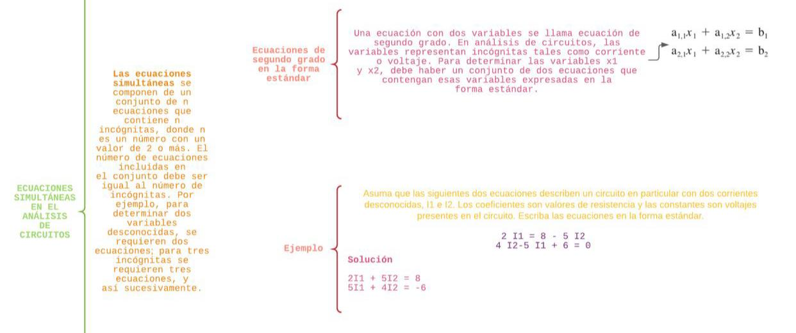
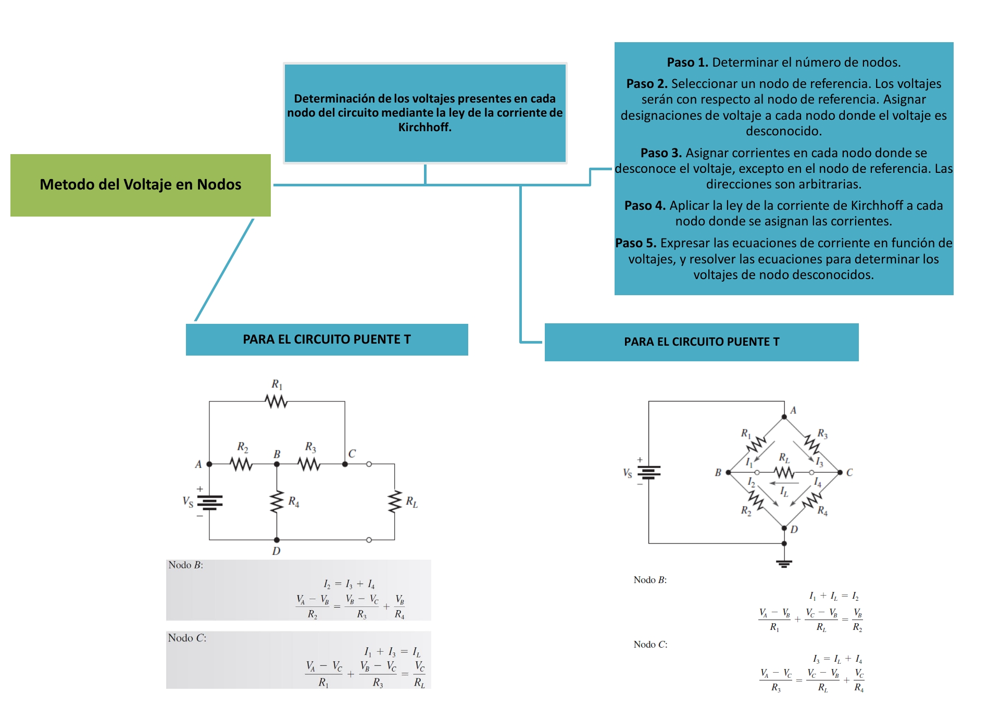
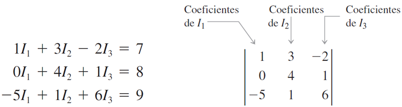
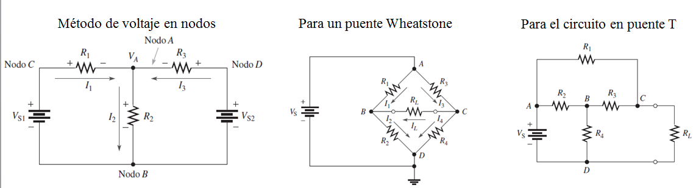

# Producto Unidad 1 
1. OBJETIVOS

• Identificar las ecuaciones simultáneas y su forma estándar para que de esta forma poder aplicar en la solución de problemas.

•	Hacer una investigación profunda sobre el tema expuesto para completar las dudas existentes 

• Comprender el método de la corriente de lazo, y poder establecer una relación entre el uso de la Ley de Ohm y las Leyes de Kirchhoff   con   ésta, además   de   los conceptos   básicos del   análisis de circuitos.
 

•	Aplicar el método de la corriente de lazo para determinar las corrientes en los elementos de un circuito.

• Utilizar el método de la corriente en ramas para determinar las corrientes o voltajes desconocidos en un circuito utilizando las leyes de voltajes y corrientes de Kirchhoff.

•	

•	

2. MARCO TEÓRICO

3. Diagramas

*ECUACIONES SIMULTÁNEAS EN EL ANÁLISIS DE CIRCUITOS* 

*MÉTODO DE LA CORRIENTE EN RAMAS*

*MÉTODO DE LA CORRIENTE EN NODOS*
 

4. Explicación

5. Conclusiones

•	Al finalizar este producto unidad obtuvimos un amplio conocimiento sobre lo que son ramas nodos y lazos de esta forma mejorando nuestro desempeño en la materia.

• Este proyecto es muy importante para nosotros, porque no solo aplicamos los conocimientos adquiridos en esta parte del trabajo, sino que también utilizamos toda la experiencia previa en circuitos electrónicos.

•	El método de resolución por ramas y por lazos junto a las Leyes de Kirchhoff y las Leyes de Ohm son de mucha ayuda al resolver problemas de circuitos ya que gracias a todas estas nos facilita el cálculo al tratar de buscar lo que nos pide un problema ya sea el voltaje o la corriente.

•	Los métodos de análisis de ramas y lazos son herramientas que permiten aplicar de una forma organizada las Leyes de Kirchhoff (KVL KCL) las cuales nos ayudan a resolver problemas complejos con un número de incógnitas y ecuaciones linealmente independientes.

•	

6. Bibliografía 

•	Floyd Thomas L, “Principios de Circuitos Eléctricos”, 8 ed. 2007 .Pearson Educación de México, S.A. de C.V. México, pp. 281-333.

A. (2019, 13 agosto). Método de la corriente por ramas. La fisica y quimica. https://lafisicayquimica.com/metodo-de-corriente-de-rama/#:%7E:text=La%20primera%20y%20m%C3%A1s%20directa,leyes%20de%20Kirchhoff%20y%20Ohm’s%20.

PantalonsCuadrados, A. A. D. (2014, 4 junio). Metodo de Las Corrientes de Ramas. Scribd. https://es.scribd.com/doc/228082904/Metodo-de-Las-Corrientes-de-Ramas

EcuRed. (2013, 11 julio). Método de las corrientes de mallas - EcuRed. https://www.ecured.cu/M%C3%A9todo_de_las_corrientes_de_mallas

C. (2021, 8 enero). Método de mallas – análisis de circuitos. dademuchconnection. https://dademuch.com/2019/11/05/metodo-de-mallas-analisis-de-circuitos/

7. Anexos

